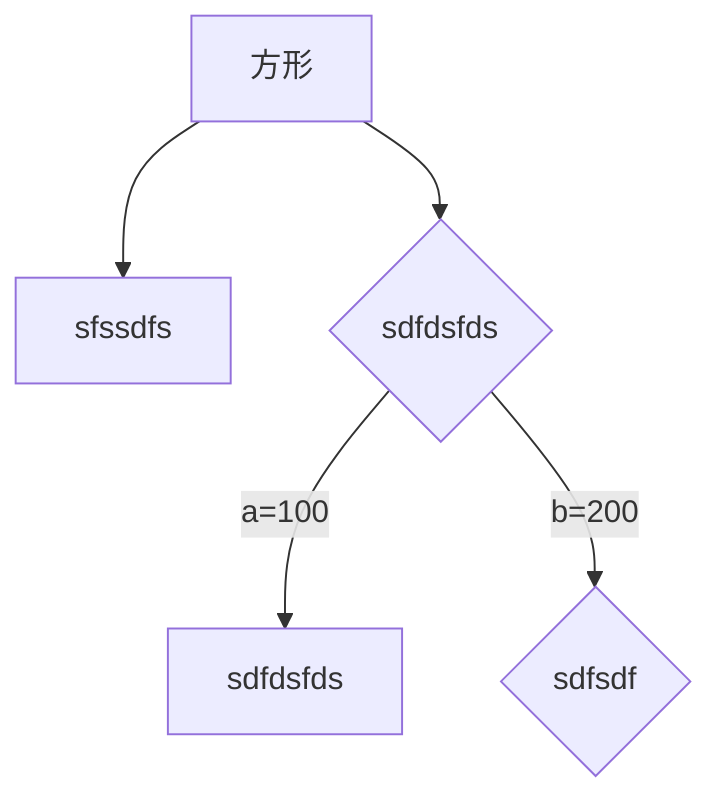

---
文章开头通过---来创建此头部说明
title:学习markdown
author:jizizihe
date:2020-1-18
---

[toc]

### 链接

<www.baidu.com>

[百度一下](www.baidu.com)

### 代码块

```java
public class helloworld {                                                                                                                                                                                    
    public static void main(String[] args) {
        System.out.println("Hello World");
    }
}
```

### 表格

| 表头 | 表头 | 表头 |
| ---- | ---- | ---- |
|      |      |      |

### 高亮

==今天是个好日子==

### 列表

-   sdfsdfds - *

*   fdsf

    *   dddsf
        *   gsdfsa

    -   dfsdsfsdf

-   sdfdsfs

1.  sdfsdfds
2.  fssssss
    1.  sdf
    2.  fdsfsdfds
        1.  s

3.  fdsfds
4.  sdfdsfs

### 任务列表

-   [x] sssss

-   [ ] sdfdsf


### 注释（区块引言）

>   几年
>
>   >   2019
>   >
>   >   >   dsafsaf

### 插入图片


### 流程图



```flow
st=>start: 开始框
op=>operation: 处理框
cond=>condition: 判断框(是或否?)
sub1=>subroutine: 子流程1
io=>inputoutput: 输入输出框
e=>end: 结束框
st->op->cond
cond(yes)->io->e
cond(no)->sub1->io
```

### 分隔符

---

### 数学符号

$$
x+y=z
$$

### 下划线

<u>sss</u>

### 表情

:smile:

### 上下标

sss^sdfdsf^

sdfsdf~sdfds~

### 删除线

~~sfsdfds~~

